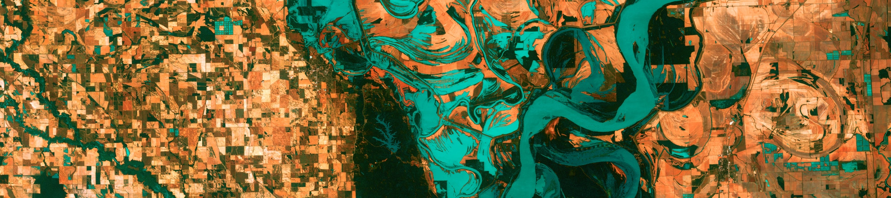

<p style="color: #ba5e00"><b>TO UPDATE THIS PAGE:</b> Open and edit the <b>topic_3.md</b> file, in <code>docs/</code> folder, to delete this placeholder text and customize with your own!</p>

## Where should I save my images?

Drop images you want to include on your site into the existing `docs/assets/images` folder within this template repository. 

## How do I make images show up on my site? 

There are few ways to add images in an markdown document. I recommend using the standard ``. 

For example, if there is an image saved as `cool_dogs.jpg` in the `docs/assets/images` folder, then you can add this to your markdown document by adding: 

```md

```

You can also update the size of the image, add a caption, etc... by using an html `<figure>` tag directly inside your markdown file (`mkdocs` can parse `html` code as well as markdown!), e.g.:

```md
<figure>
    
        <figcaption>
            Check out these cool dogs!
        </figcaption>
</figure>
```

**NOTE:** Notice that the path to the image file in the `` tag's `src=` has a leading `/meds-mkdocs-template/`, whereas the markdown code does not. This is due to subtle differences in how markdown and html code are parsed in `mkdocs`. 

For example, the image `usgs_sat.jpeg` is in the `/docs/assets/images` folder of this repo. I can have it show up here by include a code chunk that looks like this: 

```md

```

Which creates:


Or, I could use:

```html
<figure>
    
        <figcaption>
            Update this image by dropping your new image into 
            the docs/assets/images folder of the project, then open 
            the index.md & change the path to point to the new image. 
            Image: Mississippi River south of Memphis, TN, 
            from USGS shared on Unsplash
        </figcaption>
</figure>
```
Which also creates:

<figure>

<figcaption>Image: Mississippi River south of Memphis, TN, from USGS shared on Unsplash</figcaption>
</figure>


